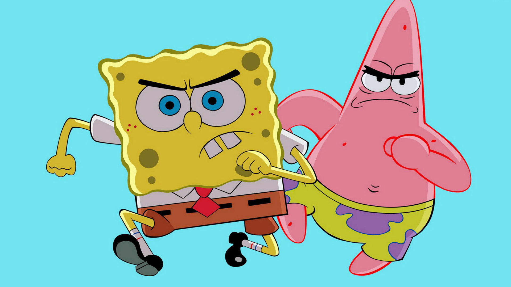
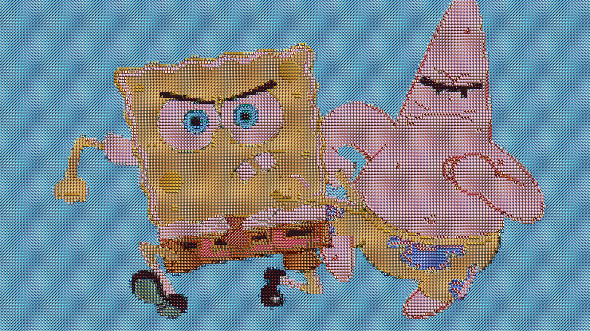
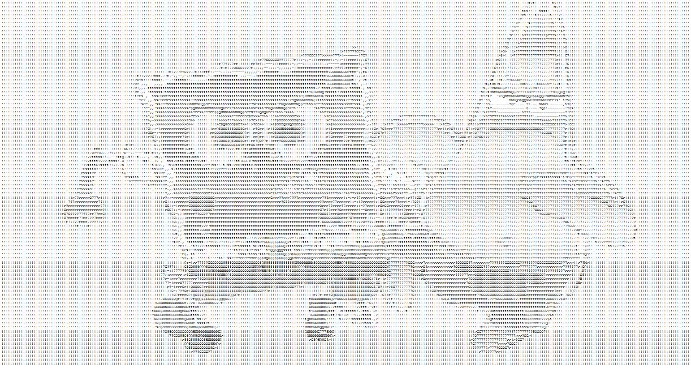

# CharacterImageAndJigsaw

字符画，灰度图，小图拼大图

很糊，很junk，简单的抠图加上对比色块替换。

程序使用JavaFx， IntelliJ IDEA编写，在jdk1.8以上编译

字符画使用字符 

    String[] arr={"M","N","H","Q","$","O","C","?","7",">","!",":","–",";","."};

## 拼图部分
以下拼图所用小图来自<a href="https://github.com/yanghaoMine4ever/CharacterImageAndJigsaw/tree/master/resource">这里</a>

包括上面这些等等...

#### 原图

### 拼图

#### 原图

### 拼图

#### 原图

### 拼图

## 字符画

testGrey.html是用来测字符灰度的，改变里面的char字符串，
copy输出到console的字符到ControllerOne里面的String数组里

